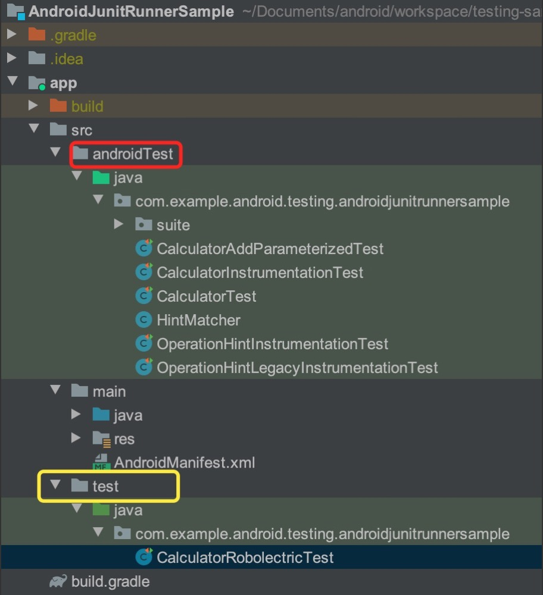
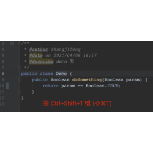
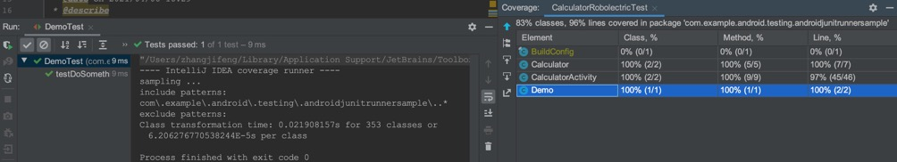
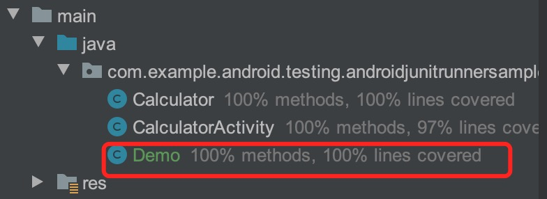
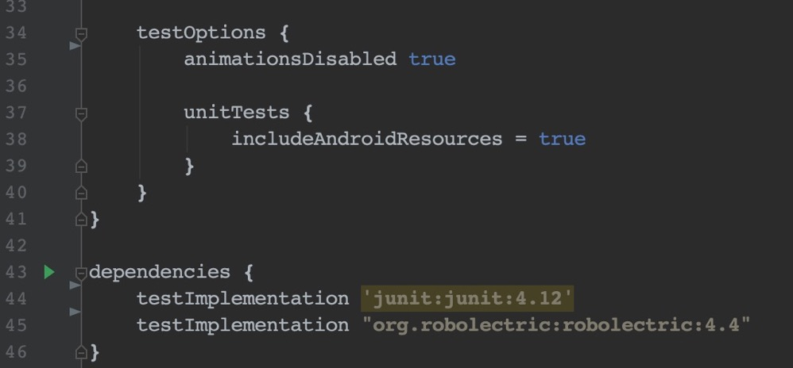
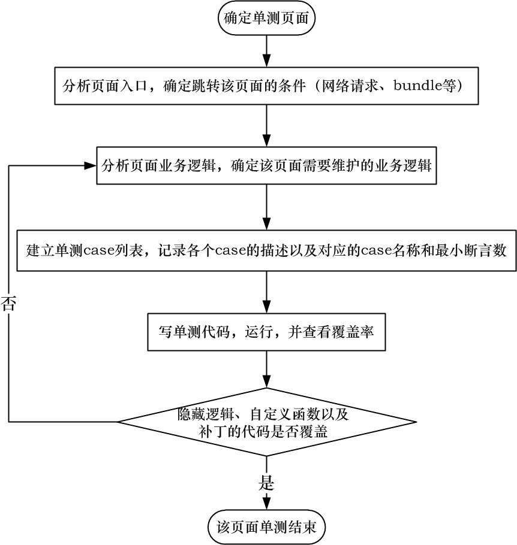

### **1. 单元测试的介绍**

> 处于高速迭代开发中的 Android 项目往往需要除黑盒测试外更加可靠的质量保障，这正是单元测试的用武之地。单元测试周期性对项目进行函数级别的测试，在良好的覆盖率下，能够持续维护代码逻辑，从而支持项目从容应对快速的版本更新。

> 单元测试是参与项目开发的工程师在项目代码之外建立的白盒测试工程，用于执行项目中的目标函数并验证其状态或者结果，其中，单元指的是测试的最小模块，通常指函数。如图1所示的绿色文件夹即是单元测试工程。这些代码能够检测目标代码的正确性，打包时单元测试的代码不会被编译进入APK中。




#### **1.1 单元测试给我们带来的好处**
##### **① 验证我们代码的正确性，我们写完代码通常要自己测试验证一番才会交付给QA进行测试**
 > 通常大家自我测试的方法就是跑一些程序，简单测试一下其中主要的分支场景，如果通过就认为自己的代码没有问题可以交付给QA了。但是事实上运行代码是很难测试一些特殊场景或者覆盖全部分支条件，比如很难模拟IOException，数据库访问异常等场景，或者穷尽各种边界条件等。而我们通过单元测试可以很轻松的构建各种测试场景，从而几乎100%确认我们的代码是可以交付给QA的
##### **② 保证修改(重构)的正确性**
> 很多时候我们不敢修改（重构）老代码的原因，就是不知道它的影响范围，担心其它模块因为依赖它而不工作，有了单元测试之后，只要在改完代码后运行一下单测就知道改动对整个系统的影响了，从而可以让我们放心的修改（重构）代码
##### **③ 加深我们对业务的理解**
> 写单测得过程其实就是测试用例书写的过程，需要考虑业务的各种场景，从而可以使我们跳出代码来思考业务，这样可以反过来思考我们的代码是否满足业务的需求
##### **④ 单元测试是最好的开发文档**
> 因为单元测试覆盖了接口的所有使用方法，是最好的示例代码。而真正的文档包括注释很有可能和代码不同步，并且看不懂。

#### **1.3 先写单测还是后写单测**
##### **先写代码后写单测，其实是为了保证或者验证我们的代码的正确性**
> 先写代码后写单测，很有可能落入一个误区，那就是照着代码写单测，难道这样做不对吗？其实这样做只能保证你写出来的代码都是对的，但是并不能保证你没有漏掉一些分支条件。

##### **先写单测后写代码又叫测试驱动开发(TDD)，其实是从业务角度驱动开发**
> 测试驱动是从业务场景出发，是真正意义上的先设计测试用例，然后写代码，这样做其实通常是为了证明你的代码是错误的，这也是QA存在的目的，他们的出发点绝对不是为了证明你的代码是对的。

先写代码后写单元测试，测试编写很可能会变成一种体力劳动。开发人员在开发完某个功能后才去写测试方法，把这当成一种在提交代码前需要完成的行政命令来执行，这样做单元测试的价值就会大打折扣。

#### **1.4 单元测试的覆盖率**
> 单元测试的覆盖率达到多少才是科学的？
> 
> 这个需要开发人员先问下自己哪些代码不需要写单元测试，为什么不需要写单元测试。
> 理想情况下排除这些真正不需要单测的代码外，**单元测试应该覆盖你的每一行代码**。

**注**： Android 有强 UI 属性，一些强 UI 的不是很方便直接进行测试，这部分可以交给 QA 进行黑盒测试，其余业务，逻辑的代码尽量做到全覆盖。

#### **1.5 写单元测试的障碍**
* **没有真正体会到单测的好处，只是为了完成任务，觉得单测没啥用**
* **好的单测至少需要不少于写代码的时间，任务排期时没有把单测估算进去，导致没有必要的时间来写单测代码**

### **2. Java 单元测试**
单元测试的目标函数主要有三种
* 目标函数有明确的返回值，写单元测试时只需调用这个函数，然后验证函数的返回值是否符合预期结果
* 目标函数只改变对象内部的一些属性或者状态，函数本身没有返回值，那就验证它所改变的属性和状态
* 目标函数没有返回值，也没有直接改变哪个值的状态，那就需要验证其行为，比如点击事件

> 注：既没有返回值，也没有改变状态，又没有触发行为的函数是不可测试的，在项目中不应该存在

> 当同时具备上述多种特性的目标函数，建议采用多个 case 来针对每一种特性逐一验证

构造用例的原则是测试用例与函数一对一(具备多个特性的可以例外)，实现条件覆盖与路径覆盖。Java单元测试中，良好的单元测试是需要保证所有函数执行正确的，即所有边界条件都验证过，一个用例只测一个函数，便于维护。

```java
public class Demo {
    public Boolean doSomething(Boolean param) {
        return param == Boolean.TRUE;
    }
}
```


生成测试类后添加我们的单元测试代码，覆盖所有的条件和路径
```java
public class DemoTest extends TestCase {
    public void testDoSomething() {
        Demo demo = new Demo();
        assertTrue(demo.doSomething(true));
        assertThat(false, is(equals(demo.doSomething(false))));
        assertThat(false, is(equals(demo.doSomething(null))));
    }
}
```
也可以像 New File 一样操作在指定目录(test)新建一个 class，然后实现测试代码的编写
```java
@RunWith(JUnit4ClassRunner.class)
public class DemoTest{
    @Test
    public void testDoSomething() {
        Demo demo = new Demo();
        assertTrue(demo.doSomething(true));
        assertThat(false, is(equals(demo.doSomething(false))));
        assertThat(false, is(equals(demo.doSomething(null))));
    }
}
```
在测试类文件上右键 Run 'DemoTest' with Coverage 后得到测试结果




### **3. Android 单元测试**
在 Android 中，单元测试的本质依旧是验证函数的功能，测试框架也是JUnit。在Java中，编写代码面对的只有类、对象、函数，编写单元测试时可以在测试工程中创建一个对象出来然后执行其函数进行测试，而在Android中，编写代码需要面对的是组件、控件、生命周期、异步任务、消息传递等，虽然本质是 SDK 主动执行了一些实例的函数，但创建一个 Activity 并不能让它执行到resume 的状态，因此需要 JUnit 之外的框架支持。

当前主流的单元测试框架有 **AndroidTest** 和 **Robolectric**，前者需要运行在 Android 环境上(运行在真机或模拟器上)，后者可以直接运行在 JVM 上，无需准备Android环境， 速度也更快。因此我们的单元测试基于 Robolectric。对于一些测试对象依赖度较高而需要解除依赖的场景，我们可以借助 Mock 框架。

>Android单元测试依旧需要JUnit框架的支持，Robolectric只是提供了Android代码的运行环境

##### **3.1 Robolectric环境配置**


上述配置中要注意的是 testOptions 里 unitTests#includeAndroidResource，需要设置 为true，不然无法找到资源

##### **3.2 单元测试编写结构**
单元测试也是一个标准的Java工程，以类为文件单位编写，执行的最小单位是函数，测试用例（以下简称case）是带有 @Test 注解的函数，单元测试里面带有case的类由Robolectric框架执行，需要为该类添加注解@RunWith(RobolectricTestRunner.class)。基于Robolectric的代码结构如下：
```java
@RunWith(RobolectricTestRunner.class)
public class MainActivityTest {
    @Before
    public void setUp() {
        //执行初始化的操作
    }
    
    @After
    public void tearDown() {
        //执行清理操作
    }
    
    @Test
    public void testCase() {
        //执行各种测试逻辑判断
    }
}
```
> 带有@Before注解的函数在该类实例化后，会立即执行，通常用于执行一些初始化的操作，比如构造网络请求和构造Activity。带有@test注解的是单元测试的case，由Robolectric执行，这些case本身也是函数，可以在其他函数中调用，因此，case也是可以复用的。

> 每个case都是独立的，case不会互相影响，即便是相互调用也不会存在多线程干扰的问题。

##### **3.3 View 的点击和结果展示**
```java
private CalculatorActivity calculatorActivity;
private EditText et1, et2;
private TextView resultTextView;
@Before
public void setUp() {
    calculatorActivity = Robolectric.setupActivity(CalculatorActivity.class);
    resultTextView = calculatorActivity.findViewById(R.id.operation_result_text_view);
}

@After
public void tearDown() {
    calculatorActivity = null;
    et1 = null;
    et2 = null;
    resultTextView = null;
}

@Test
public void noOperandShowsComputationError() {
    final String expectedResult = calculatorActivity.getString(R.string.computationError);
    calculatorActivity.findViewById(R.id.operation_add_btn).performClick();
    assertEquals(expectedResult, resultTextView.getText().toString());
}
```
>Robolectric.setupActivity()用于构造 Activity 并展示，create()函数执行后，该Activity 会运行到 onCreate 周期，resume() 则对应 onResume 周期
```java
public static <T extends Activity> T setupActivity(Class<T> activityClass) {
	return buildActivity(activityClass).setup().get();
}

public ActivityController<T> setup() {
	return create().start().postCreate(null).resume().visible();
}
```
assertEquals 是 JUnit 中的断言，Robolectric 只提供运行环境，逻辑判断还是需要依赖 JUnit 中的断言。

### **4. Mock vs Spy**
如果要测试的目标对象依赖关系较多，需要解除依赖关系，以免测试用例过于复杂，通常使用 Mockito 框架，该框架可以模拟出对象来，而且本身提供了一些验证函数执行的功能。Mockito配置如下：
```java
testImplementation 'org.mockito:mockito-core:3.1.0'
```
#### **4.1 Mock**
指定需要 mock 的类型类（接口或者实现类），生成 Mock 类，其中所有的方法都不是真实的方法，而且返回值都是默认值(0, false, null)
```java
Demo mockDemo = mock(Demo.class);
System.out.println(mockDemo.doSomething(true));

--------output-------
false
```
为了返回我们需要的 mock 结果，通常需要增加 mock 语句，也就是常说的打桩(stubbed)
```java
Demo mockDemo = mock(Demo.class);
Mockito.when(mockDemo.doSomething(true)).thenReturn(true);
System.out.println(mockDemo.doSomething(true));

--------output-------
true
```

上述 Mock 对象调用的只能是打桩方法，并不是真实的方法，我们需要调用真实方法时可以使用doCallRealMethod
```java
Demo mockDemo = mock(Demo.class);
doCallRealMethod().when(mockDemo).doSomething(true);
boolean ret = mockDemo.doSomething(true);
System.out.println("mock doSomething ret="+ret);

--------output-------
mock doSomething ret=true
```
#### 4.2 Spy
Spy 机制可以监视一个真实的对象，这时对它进行方法调用将执行真实的方法，同时也可以打桩指定的方法。总结来说， Spy 机制提供了部分mock的能力。
```java
Demo demo = new Demo();
Demo spyDemo = spy(demo);
boolean ret = spyDemo.doSomething(true);
System.out.println("spy doSomething ret="+ret);

--------output-------
spy doSomething ret=true
```
为了得到我们需要mock的结果，我们需要对 spy 对象打桩，这里有个需要特别注意的地方，针对 spy 对象打桩有两种方法，他们有着非常大的区别
```java
//Demo.java
public class Demo {
    public String doSomething2() {
        System.out.print("invoked!");
        return "doSomethine2";
    }
}

//Test.java
@Test
public void testSpy() {
    Demo spyDemo = spy(new Demo());
    System.out.println(spyDemo.doSomething2()); //未打桩，输出invoked!doSomethine2
    doReturn("spy").when(spyDemo).doSomething2(); //打桩方式 1
    System.out.println(spyDemo.doSomething2());
    Mockito.reset(spyDemo);
    when(spyDemo.doSomething2()).thenReturn("spy"); //打桩方式 2
    System.out.println(spyDemo.doSomething2());
}

------- output ------
invoked!doSomethine2
spy
invoked!spy
```
从上述代码和输出可以看出两种打桩方式的区别，方式 1 mock 了方法本身，方法体不会被执行， 方式 2 只是 mock 了返回值，方法体仍然得到执行

### **5. OKHttp Mock**
#### **5.1 业务逻辑中返回 mock 的 response**
OKHttp 提供了拦截器机制，可以通过拦截请求来 mock response，
```java
public class MockResponseInterceptor implements Interceptor {
    private final String responeJsonPath;

    public MockDataIntercepter(String responeJsonPath) {
        this.responeJsonPath = responeJsonPath;
    }
    @Override
    public Response intercept(Chain chain) throws IOException {
        String responseString = createResponseBody(chain);
        //Response 配置
        Response response = new Response.Builder()
                .code(200)
                .message(responseString)
                .request(chain.request())
                .protocol(Protocol.HTTP_1_0)
                .body(ResponseBody.create(MediaType.parse("application/json"), responseString.getBytes()))
                .addHeader("content-type", "application/json")
                .build();
        return response;
    }


    /**
     * 该方法是为动态的配置各个接口数据，为此，需要对各个接口的注解，进行
     * 拦截处理，以实现加载不同的json数据
     * @param chain
     * @return
     */
    private String createResponseBody(Chain chain) {
        String responseString = null;
        HttpUrl httpUrl = chain.request().url();
        String urlPath = httpUrl.url().toString();

        //url 匹配形式进行数据返回
        if (urlPath.matches("^(/users/)+[^/]+(/login)$")) {//匹配/users/{username}/login
            responseString = getResponseString("users_login.json");
        } else if (urlPath.matches("^(/users/)+[^/]*+$")) {//匹配/users/{username}
            responseString = getResponseString("test.json");
        }
        return responseString;
    }

    private String getResponseString(String fileName) {
        return FileUtils.readFile(responeJsonPath +fileName,"UTF-8");
    }
}
```
将该拦截器加入到 OkHttp 的拦截器数组中，即可根据不同的请求返回 mock 的 response
```java
OkHttpClient.Builder builder = new OkHttpClient.Builder();
...
builder.addInterceptor(new MockResponseInterceptor(application));
```
#### **5.2 MockWebServer**
> 可编写脚本的Web服务器，用于测试HTTP客户端

MockWebServer 和 Mockito的用法一致:

1. Script the mocks.
2. Run application code.
3. Verify that the expected requests were made.

如下是一个简单的实例，可以看出用来测试服务端接口非常方便
```java
public void test() throws Exception {
  // Create a MockWebServer. These are lean enough that you can create a new
  // instance for every unit test.
  MockWebServer server = new MockWebServer();

  // Schedule some responses.
  server.enqueue(new MockResponse().setBody("hello, world!"));
  server.enqueue(new MockResponse().setBody("sup, bra?"));
  server.enqueue(new MockResponse().setBody("yo dog"));

  // Start the server.
  server.start();

  // Ask the server for its URL. You'll need this to make HTTP requests.
  HttpUrl baseUrl = server.url("/v1/chat/");

  // Exercise your application code, which should make those HTTP requests.
  // Responses are returned in the same order that they are enqueued.
  Chat chat = new Chat(baseUrl);

  chat.loadMore();
  assertEquals("hello, world!", chat.messages());

  chat.loadMore();
  chat.loadMore();
  assertEquals(""
      + "hello, world!\n"
      + "sup, bra?\n"
      + "yo dog", chat.messages());

  // Optional: confirm that your app made the HTTP requests you were expecting.
  RecordedRequest request1 = server.takeRequest();
  assertEquals("/v1/chat/messages/", request1.getPath());
  assertNotNull(request1.getHeader("Authorization"));

  RecordedRequest request2 = server.takeRequest();
  assertEquals("/v1/chat/messages/2", request2.getPath());

  RecordedRequest request3 = server.takeRequest();
  assertEquals("/v1/chat/messages/3", request3.getPath());

  // Shut down the server. Instances cannot be reused.
  server.shutdown();
}
```
### **6. 多线程的单测**
上述的单测都没有线程同步的问题，日常在开发中会有一些操作是会涉及多线程，那多线程的同步导致的异常并不是总能发生，所以涉及多线程同步的方法也需要纳入单测中。

方法大致是通过 CountDownLatch 等待所有的线程都准备好后，让多个线程同时开始执行，尽量给多线程同步出错创造机会，来验证我们的多线程代码是否符合预期

```java
public static void assertConcurrent(final String message, final List<? extends Runnable> runnables, final int maxTimeoutSeconds) throws InterruptedException {
    final int numThreads = runnables.size();
    final List<Throwable> exceptions = Collections.synchronizedList(new ArrayList<Throwable>());
    final ExecutorService threadPool = Executors.newFixedThreadPool(numThreads);
    try {
        final CountDownLatch allExecutorThreadsReady = new CountDownLatch(numThreads);
        final CountDownLatch afterInitBlocker = new CountDownLatch(1);
        final CountDownLatch allDone = new CountDownLatch(numThreads);
        for (final Runnable submittedTestRunnable : runnables) {
            threadPool.submit(new Runnable() {
                public void run() {
                    allExecutorThreadsReady.countDown();
                    try {
                        afterInitBlocker.await();
                        submittedTestRunnable.run();
                    } catch (final Throwable e) {
                        exceptions.add(e);
                    } finally {
                        allDone.countDown();
                    }
                }
            });
        }
        // wait until all threads are ready
        assertTrue("Timeout initializing threads! Perform long lasting initializations before passing runnables to assertConcurrent", allExecutorThreadsReady.await(runnables.size() * 10, TimeUnit.MILLISECONDS));
        // start all test runners
        afterInitBlocker.countDown();
        assertTrue(message +" timeout! More than" + maxTimeoutSeconds + "seconds", allDone.await(maxTimeoutSeconds, TimeUnit.SECONDS));
    } finally {
        threadPool.shutdownNow();
    }
    assertTrue(message + "failed with exception(s)" + exceptions, exceptions.isEmpty());
}
```

### **7. 异常情况的测试**
#### **7.1 使用 assertThrows 方法**
assertThrows 方法时 Junit4.13 中新增的，使用此方法，您可以断言给定的函数调用抛出的特定类型的异常。它会返回抛出的异常，以便可以进行进一步的断言（例如，验证消息和原因是否正确）。此外，可以在引发异常后对对象的状态进行断言
```java
@Test
public void testExceptionUseAssertThrows() {
    final List<Object> list = new ArrayList<>();
    IndexOutOfBoundsException thrown = Assert.assertThrows(
            IndexOutOfBoundsException.class,
            new ThrowingRunnable() {
                @Override
                public void run() {
                    list.add(1, new Object());
                }
            });

    // assertions on the thrown exception
    assertEquals("Index: 1, Size: 0", thrown.getMessage());
    // assertions on the state of a domain object after the exception has been thrown
    assertTrue(list.isEmpty());
}
```
#### **7.2 使用 try...catch 的方式**
在 JUnit4.13 版本之前可以使用这种 try...catch 的方式，它的用法和 Java 的语法一致
```java
@Test
public void testExceptionMessage() {
    List<Object> list = new ArrayList<>();

    try {
        list.get(0);
        fail("Expected an IndexOutOfBoundsException to be thrown");
    } catch (IndexOutOfBoundsException anIndexOutOfBoundsException) {
        assertThat(anIndexOutOfBoundsException.getMessage(), is("Index: 0, Size: 0"));
    }
}
```
#### **7.3 在@Test 注解后使用 expected 指定期望的 Exception**
@Test 注解有个可选的参数“expected”，它可以指定一个 Throwable 的子类，如果想要验证case是否抛出正常的 Exception，可以使用如下写法：
```java
@Test(expected = IndexOutOfBoundsException.class)
public void testExceptionUseExpected() {
    new ArrayList<Object>().get(0);
}
```
### **8. ViewModel 和 LiveData 的单元测试**
测试 LiveData 需要做下面两件事：
* 使用 InstantTaskExecutorRule
* 确保 LiveData 被观察

InstantTaskExecutorRule 是 JUnit 的一个规则，使用 @Rule 注解引入，该规则可以在同一线程中运行所有与架构组件相关的后台任务，目的是为了测试结果以同步顺序发生。

#### **Step 1. Use InstantTaskExecutorRule**
在app/build.gradle中引入依赖
```groovy
testImplementation 'android.arch.core:core-testing:1.1.1'
```
在 ViewModelTest 中添加 InstantTaskExecutorRule
```java
@Rule
public InstantTaskExecutorRule instantTaskExecutorRule = new InstantTaskExecutorRule();
```
#### **Step 2. Add the LiveDataTestUtil.java Class**
需要确保测试的 LiveData 是被观察的，在测试代码中你肯能没有 activity 或 fragment 来观察 LiveData，为了解决这个问题，可以使用 observeForever 确保不需要 LifecycleOwner 也能观察到 LiveData。同时要注意要记得 removeObserver 来避免 observer 泄漏。

大致代码如下：
```java
@Test
public void testLiveData() {
    // Given a fresh ViewModel
    CalculatorViewModel calculatorViewModel = new CalculatorViewModel();

    // Create observer - no need for it to do anything!
    Observer<String> observer = new Observer<String>();
    try {
        // Observe the LiveData forever
        calculatorViewModel.calculatorResultLiveData.observeForever(observer);
        // When calc add Operator
        calculatorViewModel.calc(1.0f, 2.0f, Calculator.Operator.ADD);
        // Then the calc result is triggered
        String result = calculatorViewModel.calculatorResultLiveData.getValue();
        Assert.assertEquals("3.0", result);
    } finally {
        calculatorViewModel.calculatorResultLiveData.removeObserver(observer);
    }
}
```

> 可以看到每个 test case 方法里有很多样板代码，我们将观察 LiveData 的样板代码抽离成 Util 方法
```java
public class LiveDataTestUtil {
    public static long time = 2;
    public static TimeUnit timeUnit = TimeUnit.SECONDS;

    public static<T> T getOrAwaitValue(final LiveData<T> liveData) {
        final T[] data = (T[]) new Object[]{null};
        final CountDownLatch latch = new CountDownLatch(1);
        Observer<T> observer = new Observer<T>() {
            @Override
            public void onChanged(@Nullable T t) {
                data[0] = t;
                latch.countDown();
                liveData.removeObserver(this);
            }
        };
        liveData.observeForever(observer);
        try {
            if (latch.getCount() == 1 && latch.await(time, timeUnit)) {
                throw new TimeoutException("LiveData value was never set.");
            }
        } catch (Exception e) {
            e.printStackTrace();
        } finally {
            liveData.removeObserver(observer);
        }
        return data[0];
    }
}
```
使用 util 后的 test case 就非常精简了
```java
@Test
public void calcTest_getOrAwaitValue() {
    calculatorViewModel.calc(1, 2, Calculator.Operator.ADD);
    String result = LiveDataTestUtil.getOrAwaitValue(calculatorViewModel.calculatorResultLiveData);
    Assert.assertEquals("3.0", result);
}
```

### **9. Android 单元测试的流程**
实际项目中，单元测试对象与页面是一对一的，并不建议跨页面，这样的单元测试藕合度太大，维护困难。

单元测试需要找到页面的入口，分析项目页面中的元素、业务逻辑，这里的逻辑不仅仅包括界面元素的展示以及控件组件的行为，还包括代码的处理逻辑。然后可以创建单元测试case列表，根据这个列表开始写单元测试代码。

单元测试是代码质量的保证工程，上述流程并不能完全覆盖重要的业务逻辑以及边界条件，因此，需要写完后，看覆盖率，找出单元测试中没有覆盖到的函数分支条件等，然后继续补充单元测试case列表，并在单元测试工程代码中补上Case。

直到规划的页面中所有逻辑的重要分支、边界条件都被覆盖，该项目的单元测试结束。

单元测试流程大致如下：



**参考**：
1. [JUnit wiki](https://github.com/junit-team/junit4/wiki)
2. [Robolectric](http://robolectric.org/)
3. [Mockito Doc](https://javadoc.io/doc/org.mockito/mockito-core/latest/org/mockito/Mockito.html)
4. [Android Test Sample](https://github.com/android/testing-samples/)
5. [MockWebServer](https://github.com/square/okhttp/tree/master/mockwebserver)
6. [Android codelab](https://developer.android.com/codelabs/advanced-android-kotlin-training-testing-basics)